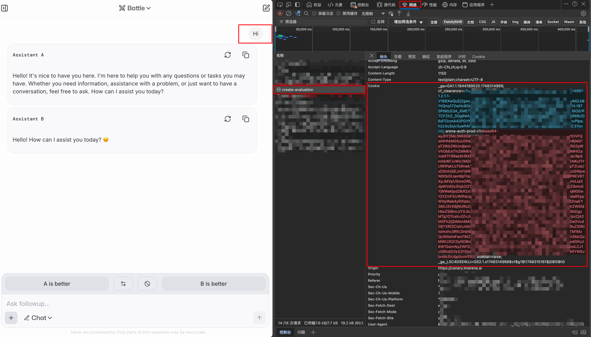

<p align="right">
   <strong>中文</strong> 
</p>
<div align="center">

# lmarena2api

_觉得有点意思的话 别忘了点个 ⭐_

<a href="https://t.me/+LGKwlC_xa-E5ZDk9">
    
    <span style="text-decoration: none; font-size: 12px; color: #0088cc; vertical-align: middle;">Telegram 交流群</span>
</a>

<sup><i>AI Wave 社群</i></sup>
<sup><i>(群内提供公益API、AI机器人)</i></sup>

</div>

## 功能

- [x] 支持对话接口(流式/非流式)(`/chat/completions`),详情查看[支持模型](#支持模型)
- [x] 支持自定义请求头校验值(Authorization)
- [x] 支持cookie池(随机),详情查看[获取cookie](#cookie获取方式)
- [x] 支持请求失败自动切换cookie重试(需配置cookie池)
- [x] 可配置代理请求(环境变量`PROXY_URL`)

### 接口文档:

略

### 示例:

略

## 如何使用

略

## 如何集成NextChat

略

## 如何集成one-api

略

## 部署

### 基于 Docker-Compose(All In One) 进行部署

```shell
docker-compose pull && docker-compose up -d
```

#### docker-compose.yml

```docker
version: '3.4'

services:
  lmarena2api:
    image: deanxv/lmarena2api:latest
    container_name: lmarena2api
    restart: always
    ports:
      - "10088:10088"
    volumes:
      - ./data:/app/lmarena2api/data
    environment:
      - LA_COOKIE=******  # cookie (多个请以,分隔)
      - API_SECRET=123456  # [可选]接口密钥-修改此行为请求头校验的值(多个请以,分隔)
      - TZ=Asia/Shanghai
```

### 基于 Docker 进行部署

```docker
docker run --name lmarena2api -d --restart always \
-p 10088:10088 \
-v $(pwd)/data:/app/lmarena2api/data \
-e LA_COOKIE=***** \
-e API_SECRET="123456" \
-e TZ=Asia/Shanghai \
deanxv/lmarena2api
```

其中`API_SECRET`、`LA_COOKIE`修改为自己的。

如果上面的镜像无法拉取,可以尝试使用 GitHub 的 Docker 镜像,将上面的`deanxv/lmarena2api`替换为
`ghcr.io/deanxv/lmarena2api`即可。

### 部署到第三方平台

<details>
<summary><strong>部署到 Zeabur</strong></summary>
<div>

[](https://zeabur.com?referralCode=deanxv&utm_source=deanxv)

> Zeabur 的服务器在国外,自动解决了网络的问题,~~同时免费的额度也足够个人使用~~

1. 首先 **fork** 一份代码。
2. 进入 [Zeabur](https://zeabur.com?referralCode=deanxv),使用github登录,进入控制台。
3. 在 Service -> Add Service,选择 Git（第一次使用需要先授权）,选择你 fork 的仓库。
4. Deploy 会自动开始,先取消。
5. 添加环境变量

   `LA_COOKIE:******`  cookie (多个请以,分隔)

   `API_SECRET:123456` [可选]接口密钥-修改此行为请求头校验的值(多个请以,分隔)(与openai-API-KEY用法一致)

保存。

6. 选择 Redeploy。

</div>


</details>

<details>
<summary><strong>部署到 Render</strong></summary>
<div>

> Render 提供免费额度,绑卡后可以进一步提升额度

Render 可以直接部署 docker 镜像,不需要 fork 仓库：[Render](https://dashboard.render.com)

</div>
</details>

## 配置

### 环境变量

1. `PORT=10088`  [可选]端口,默认为10088
2. `DEBUG=true`  [可选]DEBUG模式,可打印更多信息[true:打开、false:关闭]
3. `API_SECRET=123456`  [可选]接口密钥-修改此行为请求头(Authorization)校验的值(同API-KEY)(多个请以,分隔)
4. `LA_COOKIE=******`  cookie (多个请以,分隔)
5. `REQUEST_RATE_LIMIT=60`  [可选]每分钟下的单ip请求速率限制,默认:60次/min
6. `PROXY_URL=http://127.0.0.1:10801`  [可选]代理
7. `ROUTE_PREFIX=hf`  [可选]路由前缀,默认为空,添加该变量后的接口示例:`/hf/v1/chat/completions`

### cookie获取方式

1. 打开[lmarena](https://beta.lmarena.ai/)。
2. 打开**F12**开发者工具
3. 进行一次对话
4. 如下图所示,右侧`evaluation`或`messages`请求中请求头`supabase-jwt`中的蓝色高亮的值即为所需 cookie 值,即环境变量`LA_COOKIE`。



## 进阶配置

略

## 支持模型

| 模型名称                                    |
|-----------------------------------------|
| claude-3-5-sonnet-20241022              |
| claude-3-5-haiku-20241022               |
| claude-3-7-sonnet-20250219              |
| claude-3-7-sonnet-20250219-thinking-32k |
| gemini-2.0-flash-001                    |
| gemini-2.5-flash-preview-04-17          |
| gemini-2.5-pro-preview-05-06            |
| gemma-3-27b-it                          |
| chatgpt-4o-latest-20250326              |
| gpt-4.1-2025-04-14                      |
| gpt-4.1-mini-2025-04-14                 |
| llama-3.3-70b-instruct                  |
| llama-4-maverick-03-26-experimental     |
| llama-4-maverick-17b-128e-instruct      |
| grok-3-preview-02-24                    |
| grok-3-mini-beta                        |
| mistral-medium-2505                     |
| qwen-max-2025-01-25                     |
| qwen3-30b-a3b                           |
| qwen3-235b-a22b                         |
| deepseek-v3-0324                        |
| amazon.nova-pro-v1:0                    |
| command-a-03-2025                       |
| o3-2025-04-16                           |
| o3-mini                                 |
| o4-mini-2025-04-16                      |
| qwq-32b                                 |


## 报错排查

略

## 其他

略